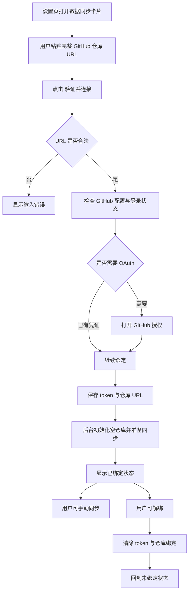

# GitHub 同步绑定设计文档

## 概述

本次设计补全 Tomato App 的 GitHub 同步绑定流程。用户先准备一个完整的 GitHub 仓库 URL，App 在设置页中完成授权、绑定、后台初始化空仓库，并支持解绑回到未绑定状态。

这次设计的重点不是重新定义整个同步系统，而是把当前已经存在的同步能力补成一个可配置、可恢复、可理解的产品流程。

## 目标

- 支持用户粘贴完整 GitHub 仓库 URL 作为同步目标
- 点击连接后自动完成 GitHub OAuth 授权
- 授权成功后保存 token 与仓库绑定信息
- 支持空仓库，首次绑定时由后台自动初始化
- 绑定成功后明确显示已登录、已绑定、最近同步等状态
- 支持解绑，解绑后回到未配置状态
- 遇到 URL 无效、登录失败、GitHub 配置缺失、网络失败时给出明确错误

## 非目标

- 不新增“创建 GitHub 仓库”的向导
- 不在 UI 中单独暴露“空仓库初始化”步骤
- 不实现多仓库切换
- 不实现团队协作或多用户权限
- 不重做整个同步引擎的数据模型

## 用户流程

## UI 设计

### 位置

数据同步仍然放在设置页中，但采用一个高可见度的内联卡片，不再依赖用户先发现隐藏入口。卡片默认显示以下内容：

- 标题：`数据同步`
- 说明文案：先填写完整仓库 URL，App 会自动完成授权和绑定
- 仓库地址输入框
- `验证并连接` 按钮
- 当前状态标签
- `解绑` 按钮
- 错误提示区

### 绑定态

绑定成功后，卡片显示：

- `已登录 GitHub`
- `仓库已绑定`
- 最近同步时间
- `立即同步` 按钮
- `解绑` 按钮

### 未绑定态

未绑定时，卡片应当让用户一眼知道下一步是什么：

- 输入框始终可见
- 连接按钮始终可见
- 说明文字直接提示支持空仓库
- 不要求用户先展开折叠区或跳转到向导

### 错误态

错误信息应优先展示在同步卡片内部，而不是仅依赖控制台日志。错误文案要区分以下几类：

- 仓库 URL 格式不合法
- GitHub OAuth 配置缺失
- OAuth 过程取消或失败
- 网络失败或 GitHub 返回错误
- 后台初始化失败

## 数据与状态

### 新增绑定信息

同步能力当前只保存 token 和运行时状态，还需要补充仓库绑定信息。设计上建议新增一份持久化同步配置，至少包含：

- `repositoryUrl`
- `repositoryOwner`
- `repositoryName`
- `boundAt`
- `lastSyncTime`

其中 `repositoryOwner` 和 `repositoryName` 可以在用户输入完整 URL 后解析得到，便于后端初始化仓库时直接使用。

### 状态机

同步状态需要区分“登录状态”和“仓库绑定状态”：

- `未绑定`
- `绑定中`
- `已绑定`
- `同步中`
- `有冲突`
- `失败`

这两个维度不要混成一个状态字符串，否则 UI 很容易出现“已登录但未绑定”或“已绑定但 token 丢失”时无法表达的情况。

## 后端流程

### 连接流程

1. Renderer 发送绑定请求，携带完整仓库 URL
2. Main 进程校验 URL 结构
3. Main 进程检查 GitHub token 是否存在
4. 如果没有 token，则启动 OAuth
5. OAuth 成功后保存 token
6. 解析仓库 owner/name 并写入绑定配置
7. 初始化本地 Git 仓库与远端信息
8. 如果远端是空仓库，则自动完成首次提交与 push
9. 返回绑定结果给 Renderer

### 解绑流程

1. 用户点击解绑
2. Main 进程删除 token
3. Main 进程清除仓库绑定配置
4. 清空同步运行时状态
5. Renderer 回到未绑定态

### 空仓库处理

空仓库无需在 UI 中单独展示。后台逻辑负责判断仓库是否没有提交历史，然后自动执行首次初始化动作。这里的产品含义是：

- 用户只需要提供一个新建好的空仓库 URL
- App 会在后台把本地数据做成第一次可同步的 Git 提交
- 用户不需要理解“初始化仓库”这个技术步骤

## 失败与恢复

- 如果 URL 不是 `https://github.com/<owner>/<repo>` 形式，直接阻止连接
- 如果 GitHub OAuth 环境变量缺失，按钮点击后立即报错
- 如果 OAuth 打开了但用户取消，返回可读错误
- 如果仓库地址对应的远端不可用，提示用户检查仓库地址或权限
- 如果解绑时 token 删除失败，保留错误状态但不破坏现有绑定信息，避免半解绑

## 相关文件边界

### 需要修改的文件

- `tomato_app/src/renderer/components/Sync/SyncSettings.tsx`
- `tomato_app/src/renderer/stores/sync-store.ts`
- `tomato_app/src/main/sync/sync-service.ts`
- `tomato_app/src/main/ipc-handlers.ts`
- `tomato_app/src/shared/ipc-channels.ts`
- `tomato_app/src/preload/index.ts`

### 可能需要新增的文件

- `tomato_app/src/main/sync/repository-binding.ts`
- `tomato_app/src/main/sync/github-repository.ts`
- `tomato_app/src/renderer/components/Sync/RepositoryField.tsx`
- `tomato_app/src/renderer/components/Sync/SyncBindingStatus.tsx`

这些拆分的目的，是把“仓库 URL 解析”、“绑定状态持久化”和“UI 呈现”分开，避免 `SyncSettings.tsx` 继续膨胀成一个难以维护的大组件。

## 测试策略

### 单元测试

- 校验 GitHub 仓库 URL 解析规则
- 校验绑定状态在登录、解绑、错误、同步中的转换
- 校验空仓库初始化路径在成功与失败时的返回值

### 集成测试

- 通过 IPC 测试连接请求能正确进入 main 进程
- 通过 store 测试绑定后状态会更新为已绑定
- 通过解绑测试状态能完全重置

### E2E 测试

- 打开设置页时可直接看到同步卡片
- 输入完整仓库 URL 后能触发连接
- 连接成功后显示已绑定状态
- 解绑后回到未绑定态
- 如果 GitHub 配置缺失，UI 会显示错误而不是无响应

## 验收标准

- 用户可以在设置页直接看到同步入口
- 用户可以粘贴完整 GitHub 仓库 URL 并完成绑定
- 空仓库可以作为同步目标并在后台自动初始化
- 绑定成功后 UI 明确展示登录与绑定状态
- 用户可以解绑，解绑后同步状态被清空
- 所有失败场景都有可读错误提示

## 备注

本设计保留当前同步系统的总体方向，只补齐“仓库配置”这一层。下一步实现时，优先把仓库绑定状态和 token 状态分开建模，再逐步接入 UI 与 IPC。
