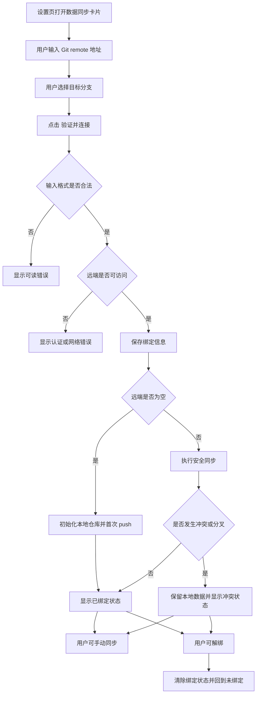

# Git 同步本地优先设计文档

## 概述

本次设计调整 Tomato App 的同步能力，使其不再依赖 App 内 GitHub OAuth，而是改为使用用户本机已经准备好的 Git 认证方式来访问远端仓库。App 只负责绑定一个可访问的 Git remote、选择目标分支、执行同步，并在冲突时优先保护本地数据。

这版设计的核心原则是：

- App 不做登录，不做 OAuth，不要求用户提供 GitHub client ID
- App 不限定远端必须是 GitHub，只要是 Git 能访问的 remote 都可以
- 绑定时由用户手动选择目标分支，不再默认假设 `main`
- 同步时本地数据优先，远端只作为同步目标，不允许自动覆盖本地内容
- 冲突发生时先保留本地状态，再提示用户继续处理

## 目标

- 支持用户输入一个可访问的 Git remote 地址完成绑定
- 支持用户在绑定时手动指定目标分支
- 绑定前验证 remote 可访问、输入格式合法，并确认用户输入的目标分支可用于当前 remote
- 空远端仓库可首次同步，后台自动初始化并推送
- 远端已有内容时执行安全同步，不做危险覆盖
- 发生分叉或冲突时保留本地数据并提供清晰恢复入口
- 支持解绑，解绑后回到未绑定状态
- 设置页清晰展示绑定状态、同步状态、目标分支和错误信息

## 非目标

- 不做 App 内 GitHub 登录
- 不做 OAuth App 注册配置
- 不要求用户输入 client ID
- 不做仓库创建向导
- 不做多仓库切换
- 不做可视化 merge editor
- 不做团队协作或权限管理

## 设计决策

### 1. 远端输入范围

App 接受“能被 Git 识别并访问的 remote 地址”，而不是只接受 GitHub URL。这样可以覆盖 HTTPS、SSH、以及其他用户本机 Git 配置支持的地址形式。

### 2. 认证模型

App 不再保存或管理 GitHub OAuth token。用户需要在系统或命令行里先准备好本机 Git 认证，例如：

- `gh auth login`
- Git Credential Manager
- SSH key
- Personal Access Token

App 只在执行 Git 命令时依赖系统已有认证环境。

### 3. 分支模型

绑定时由用户手动输入或选择目标分支。App 不再默认强制 `main`，也不自动探测远端默认分支作为绑定依据。

分支规则明确如下：

- 如果远端为空，目标分支可以是新分支，首次 push 时创建
- 如果远端已有内容，目标分支必须已经存在，且绑定时需要能被正常识别

### 4. 同步模型

同步策略是“本地优先”：

- 本地和远端都空时，执行首次初始化
- 远端为空时，自动初始化并 push 本地快照
- 远端已有数据时，执行安全的 fetch / pull / push 流程
- 一旦出现真实冲突，停止自动推进，保留本地内容，并提示用户手动处理

### 5. 冲突处理

冲突状态下不自动执行危险覆盖操作，不自动 reset 到远端，不自动丢弃本地历史。App 只提供清晰的错误和恢复入口，让用户决定后续动作。

## 用户流程

## UI 设计

### 未绑定状态

设置页中的同步卡片需要直接给出下一步操作：

- 显示远端地址输入框
- 显示目标分支输入框或选择器
- 显示“验证并连接”按钮
- 显示简短说明，提示用户先完成本机 Git 认证
- 显示支持空仓库和已有仓库的说明

文案建议：

- `请先在本机完成 Git 认证，例如使用 gh auth login、SSH key 或 Git Credential Manager，然后再绑定仓库。`

### 已绑定状态

绑定成功后，卡片显示：

- 当前 remote 地址
- 当前目标分支
- 最近同步时间
- `立即同步` 按钮
- `解绑` 按钮

### 错误状态

错误需要在设置页内可见，不能只写控制台。应区分：

- 输入格式不合法
- remote 无法访问
- 本机 Git 认证未配置
- 网络失败
- 同步冲突或分叉
- 同步失败
- 解绑失败

## 数据与状态

### 持久化绑定信息

需要新增一份同步绑定配置，用于保存用户选择的 remote 和分支。建议字段如下：

- `remoteUrl`
- `remoteLabel`
- `remoteBranch`
- `boundAt`
- `updatedAt`
- `lastSyncTime`

其中：

- `remoteUrl` 是实际用于 Git 操作的地址
- `remoteLabel` 是 UI 用来展示的友好名称，可直接取自 remote 地址或用户输入的短名称
- `remoteBranch` 是用户选择的目标分支

无论底层是否使用 GitHub，状态都必须能清楚显示“当前绑定的是哪个 remote、哪个分支”。

### 状态拆分

同步状态不应混成一个字符串。至少要区分：

- 绑定状态：未绑定 / 已绑定
- 同步状态：空闲 / 同步中 / 已同步 / 冲突 / 失败
- 错误状态：最近一次失败原因

这样 UI 可以同时表达“已经绑定，但这次同步失败”或“已绑定但当前缺少认证”等情况。

## 同步流程

### 绑定流程

1. Renderer 提交 remote 地址和目标分支
2. Main 进程校验地址格式
3. Main 进程确认远端可访问
4. Main 进程保存绑定信息
5. Main 进程初始化本地 Git 仓库
6. Main 进程把 remote 绑定到本地仓库
7. 如果远端为空，执行首次提交并 push
8. 如果远端已有内容，确认目标分支可用后执行后续同步策略

### 空远端

如果远端仓库为空，App 的行为是：

1. 确保本地目录已是 Git 仓库
2. 提交本地当前快照
3. 将 remote 与目标分支绑定
4. 推送首次内容
5. 标记为已绑定并可继续同步

这一步完全在后台自动完成，不需要单独展示“初始化空仓库”流程。

### 远端已有内容

如果远端已有提交，App 采用安全同步策略：

1. 提交本地未保存变更
2. 拉取远端变更
3. 尝试应用远端更新到本地
4. 如果没有冲突，完成同步
5. 如果发生冲突或明显分叉，停止自动推进并保留本地内容

本设计明确禁止以下行为：

- 自动用远端覆盖本地
- 自动丢弃本地提交
- 自动执行危险 reset

### 冲突处理

当同步发生冲突时：

1. 当前同步停止
2. 本地数据保持可恢复
3. UI 进入冲突态
4. 显示明确错误和恢复入口

冲突态下，App 不应让用户误以为数据已经被远端替换完成。用户需要先确认本地副本还在，再决定后续如何处理。

### 解绑流程

1. 用户点击解绑
2. Main 进程清除绑定配置
3. 清理运行时同步状态
4. 返回未绑定状态

解绑不应破坏本地已有数据。

## 后端架构

### 现有模块的调整方向

当前同步实现已经分成 main 进程服务、core 同步客户端、renderer store 和同步设置 UI。新设计建议沿用这个分层，但替换其中的 GitHub 专属假设。

需要重点调整的职责是：

- `sync-service`：去掉 OAuth/token 分支，改为通用 remote 绑定与同步协调
- `repository-binding`：从 GitHub URL 解析器升级为通用 remote + branch 绑定存储
- `sync-manager`：明确本地优先策略，减少“回滚到远端”的危险默认行为
- renderer `sync-store`：只暴露绑定状态、同步状态和错误，不再管理登录态
- `SyncSettings` 及相关组件：去掉 GitHub 登录按钮和 GitHub 专属文案

### IPC 边界

IPC 层仍然保留绑定、解绑、查询状态、同步和获取数据目录这些动作，但请求语义要更新：

- 绑定请求需要 remote 地址和目标分支
- 不再存在登录 / 登出接口
- 错误应通过返回值和状态快照一起暴露给 renderer

### 运行时状态

Main 进程需要保存：

- 当前绑定的 remote 地址
- 当前目标分支
- 最近同步时间
- 最近错误
- 当前冲突状态

这些状态应能在重启后通过持久化配置恢复。

## 兼容与迁移

现有实现里已经存在 GitHub OAuth token 和 GitHub 专属绑定文件。新版本需要明确它们的处理方式，避免旧状态污染新流程。

建议迁移策略：

- 新版本不再依赖旧 token
- 新版本不再把旧 GitHub OAuth 状态当成“已登录”
- 若旧绑定文件存在，但不符合新绑定结构，则视为未绑定
- 用户重新进入设置页后，按新流程重新绑定 remote 和分支

这样可以避免在升级后出现“界面看起来已登录，但实际上新流程无法工作”的错觉。

## 失败与恢复

- 如果 remote 地址格式不合法，阻止绑定并提示用户修正输入
- 如果 remote 不可访问，提示用户检查认证、网络和地址
- 如果本机 Git 认证未配置，提示用户先完成本机认证
- 如果同步时发生冲突，保留本地状态并展示冲突信息
- 如果解绑失败，保留原绑定状态并显示错误，不做半解绑
- 如果首次 push 失败，保留本地数据并允许用户重试

## 测试计划

### 单元测试

需要补充或更新以下测试：

- remote 地址解析和校验
- 绑定信息持久化
- 目标分支保存与恢复
- 空远端首次同步
- 远端已有内容时的安全同步
- 冲突时的本地保护行为
- 解绑清理行为

### Store 测试

renderer store 需要覆盖：

- 绑定成功后状态刷新
- 解绑后状态回到未绑定
- 同步成功后 `lastSyncTime` 更新
- 同步冲突时状态进入冲突态
- 错误信息可见

### E2E 测试

设置页验收至少覆盖：

- 未绑定态可以输入 remote 和分支
- 绑定成功后可看到 remote、分支和同步按钮
- 解绑后恢复未绑定态
- 错误态能在 UI 中直接看到
- 冲突态能展示恢复入口

## 相关文件边界

本次设计主要影响的文件范围包括：

- [`tomato_app/src/main/sync/sync-service.ts`](/Users/cbookshu/dev/temp/tomato_app/tomato_app/src/main/sync/sync-service.ts)
- [`tomato_app/src/main/sync/repository-binding.ts`](/Users/cbookshu/dev/temp/tomato_app/tomato_app/src/main/sync/repository-binding.ts)
- [`tomato_app/src/main/sync/git-credentials.ts`](/Users/cbookshu/dev/temp/tomato_app/tomato_app/src/main/sync/git-credentials.ts)
- [`tomato_app/src/main/ipc-handlers.ts`](/Users/cbookshu/dev/temp/tomato_app/tomato_app/src/main/ipc-handlers.ts)
- [`tomato_app/src/preload/index.ts`](/Users/cbookshu/dev/temp/tomato_app/tomato_app/src/preload/index.ts)
- [`tomato_app/src/shared/ipc-channels.ts`](/Users/cbookshu/dev/temp/tomato_app/tomato_app/src/shared/ipc-channels.ts)
- [`tomato_app/src/renderer/stores/sync-store.ts`](/Users/cbookshu/dev/temp/tomato_app/tomato_app/src/renderer/stores/sync-store.ts)
- [`tomato_app/src/renderer/components/Sync/SyncSettings.tsx`](/Users/cbookshu/dev/temp/tomato_app/tomato_app/src/renderer/components/Sync/SyncSettings.tsx)
- [`tomato_app/src/renderer/components/Sync/RepositoryField.tsx`](/Users/cbookshu/dev/temp/tomato_app/tomato_app/src/renderer/components/Sync/RepositoryField.tsx)
- [`tomato_app/src/renderer/components/Sync/SyncBindingStatus.tsx`](/Users/cbookshu/dev/temp/tomato_app/tomato_app/src/renderer/components/Sync/SyncBindingStatus.tsx)
- [`tomato_app/src/renderer/components/Sync/SyncStatus.tsx`](/Users/cbookshu/dev/temp/tomato_app/tomato_app/src/renderer/components/Sync/SyncStatus.tsx)
- [`tomato_app/src/renderer/components/Sync/ConflictPrompt.tsx`](/Users/cbookshu/dev/temp/tomato_app/tomato_app/src/renderer/components/Sync/ConflictPrompt.tsx)
- [`tomato_app/tests/main/sync/sync-service.test.ts`](/Users/cbookshu/dev/temp/tomato_app/tomato_app/tests/main/sync/sync-service.test.ts)
- [`tomato_app/tests/main/sync/repository-binding.test.ts`](/Users/cbookshu/dev/temp/tomato_app/tomato_app/tests/main/sync/repository-binding.test.ts)
- [`tomato_app/tests/stores/sync-store.test.ts`](/Users/cbookshu/dev/temp/tomato_app/tomato_app/tests/stores/sync-store.test.ts)
- [`tomato_app/tests/e2e/basic-acceptance-sync.spec.ts`](/Users/cbookshu/dev/temp/tomato_app/tomato_app/tests/e2e/basic-acceptance-sync.spec.ts)

## 验收标准

- 用户可以只通过填写 remote 地址和目标分支完成绑定
- App 不再要求 GitHub OAuth client ID
- App 不再弹出 GitHub 授权登录页
- 空远端可以正常绑定并首次同步
- 远端已有内容时可以完成安全同步
- 发生冲突时本地数据不会丢失
- 用户可以解绑并回到未绑定状态
- 所有失败都能在设置页里看到明确提示
- 旧的 GitHub 专属登录态不会阻塞新流程
