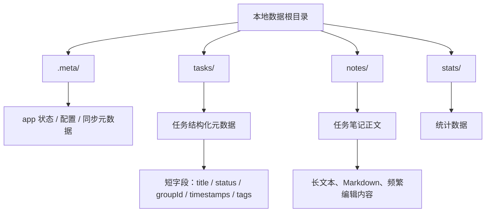
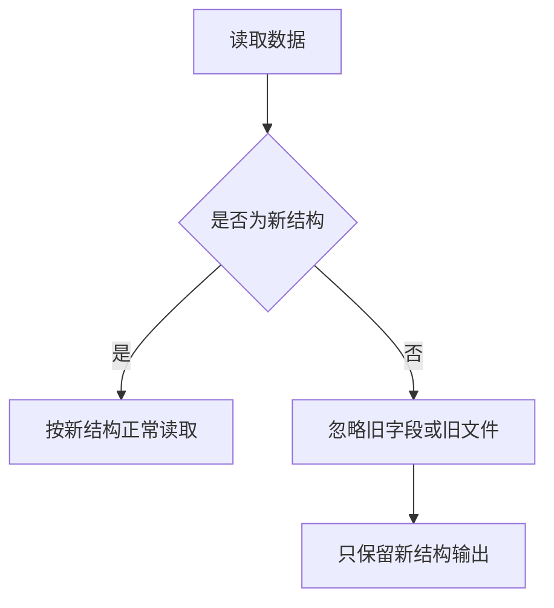
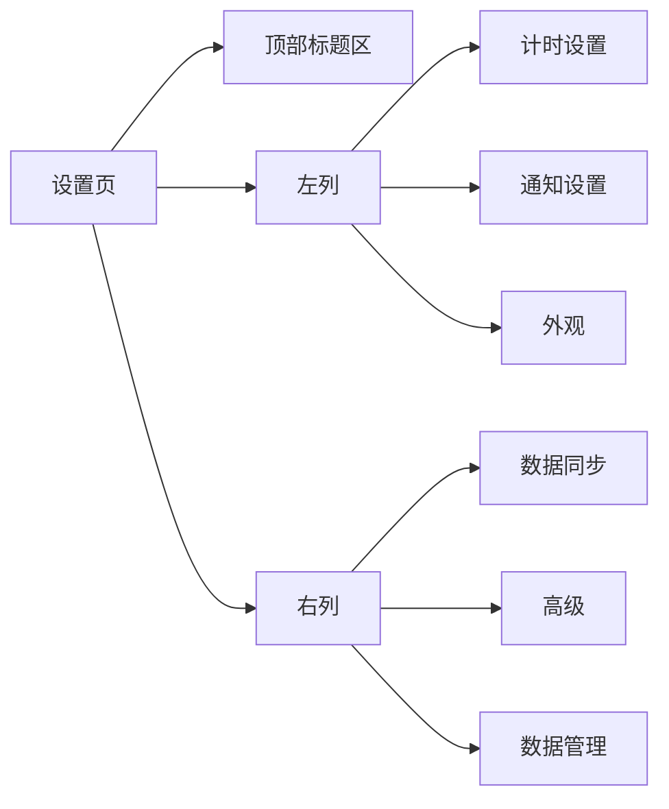

# 存储边界与设置页 UI 重设计

## 概述

本次设计分成两个互相关联的部分，但只做一次统一调整：

1. 重新划分本地目录职责，确保玩家可编辑数据不再落在 `.meta/`
2. 仅调整设置页的布局与样式，让现有功能更紧凑、更易读

这次不增加任何新功能，不改变已有交互，不新增设置项，不改变同步流程语义，只做数据边界修正和 UI 版式优化。

## 目标

- 将玩家可编辑数据从 `.meta/` 中移出
- 让任务数据与笔记数据分开存放，避免长文本和高频编辑内容混进应用状态目录
- 保持同步模型仍然是标准 Git 文件同步，便于 diff、冲突处理和备份
- 让设置页在桌面端减少无效空白和垂直滚动
- 保证按钮文案和常用控件在标准桌面宽度下不换行
- 不修改任何业务功能，只调整存储路径和界面布局

## 非目标

- 不新增设置项
- 不重做同步逻辑
- 不改任务、番茄钟、导入导出、通知等功能行为
- 不引入新的设计语言或品牌视觉
- 不做移动端专门重构，只保证窄宽度下可用
- 不要求处理历史数据迁移
- 不要求清理本地旧路径或旧文件
- 不要求把旧字段回写成新字段

## 当前问题

### 存储问题

当前实现里，任务实体 YAML 和任务笔记都和 `.meta/` 绑定得太近，导致玩家可编辑数据与 app 状态混在一起。

主要问题有三个：

- 玩家内容和应用状态边界不清
- 长文本或高频编辑字段会造成不必要的频繁写盘
- Git 同步时的 diff 粒度偏大，冲突噪音偏高

### 设置页问题

当前设置页的问题主要是版式，不是功能：

- 页面内容单列居中，宽屏下左右空白过多
- 卡片间距和内部留白偏大，导致不必要的纵向滚动
- 部分按钮和输入项在当前布局下发生换行，视觉上不整齐
- 同一页里的功能分组没有充分利用桌面宽度

## 存储设计

### 目录职责

### 目录规则

- `.meta/` 只保存 app 状态类数据
- `tasks/` 保存任务结构化数据
- `notes/` 保存任务笔记正文
- `stats/` 保存统计数据
- `tasks/` 和 `notes/` 都属于玩家可编辑数据，不能再落回 `.meta/`

### 文件格式

- `tasks/{taskId}.yaml`
  - 只放任务的结构化元数据
  - 允许短文本字段，例如标题、描述、标签、状态、时间戳
  - 不放长篇正文笔记
- `notes/{taskId}.md`
  - 只放任务笔记正文
  - 支持频繁 autosave
  - 作为独立文件参与 Git diff 和冲突处理

### `.meta/` 允许保存的内容

`.meta/` 里仍然可以保存 YAML，但只限于 app 级别状态，例如：

- 设置配置
- 同步绑定信息
- 运行时恢复所需的状态

`.meta/` 不再承载玩家主要内容，也不再承载任务正文类文本。

### 旧数据处理策略

处理要求：

- 本地过去的数据可以忽略清理
- 同步时遇到旧的不需要的字段，直接忽略
- 后续新同步即使没有这些旧字段，也不需要补回
- 新写入只遵循新结构，不反向兼容旧布局

### 同步影响

拆分后的同步收益是明确的：

- 任务 YAML 更小，更稳定
- 笔记正文单独成文件，autosave 不再频繁重写任务元数据
- Git diff 更清晰
- 冲突可以按任务和笔记分别定位
- 旧字段不会阻塞同步流程，只要新结构可读即可

## 设置页 UI 设计

### 原则

- 只调整布局和样式，不改任何功能
- 保留现有全部设置项与按钮
- 让桌面宽度优先，减少无效空白
- 让按钮文本保持单行显示
- 保持信息层级清楚，用户先看到最常用内容

### 页面结构

设置页从当前的窄单列，改为桌面端双列布局：

### 布局规则

- 顶部保留一个简短标题区，减少首屏浪费
- 桌面端使用两列网格，而不是单列居中窄卡片
- `数据同步` 放在右列顶部，作为视觉重点
- `计时设置`、`通知设置`、`外观` 放在左列
- `高级` 和 `数据管理` 放在右列下方
- 卡片间距缩小，内部 padding 变紧凑
- 移除大面积空白留边，让内容更充分利用横向空间

### 控件规则

- 输入框和标签尽量保持一行排布
- 数字输入控件保持固定宽度，避免被拉得过宽
- 开关项采用左右对齐的单行行布局
- `导出数据` 和 `导入数据` 保持并排显示，按钮宽度足够，禁止换行
- 所有现有按钮文案保持单行展示，必要时通过更合理的宽度和间距解决，不通过改文案解决

### 同步卡片

同步卡片保留现有功能内容，只做版式紧凑化：

- 仓库地址输入
- 分支输入
- 绑定按钮
- 状态提示
- 错误提示
- 数据目录展示

视觉上让同步卡片比其他卡片更突出，但不增加新控件。

### 数据管理卡片

数据管理卡片只保留现有的两个按钮：

- 导出数据
- 导入数据

按钮采用水平排列，优先避免换行。

## 响应式规则

- 宽屏桌面：双列布局
- 中等宽度：两列变窄，但仍尽量保持双列
- 窄屏：自动退回单列，但卡片间距仍保持紧凑

不要求在手机上做专门的移动端交互重构，只要内容可读、可操作即可。

## 视觉风格

- 保持现有产品气质，避免过度装饰
- 使用干净的浅色卡片和轻边框
- 通过更合理的间距与层级建立秩序感
- 不引入新的强视觉主题
- 不用额外的装饰性大块留白来“撑版面”

## 验收标准

### 存储

- `.meta/` 不再承载任务笔记正文
- `tasks/` 和 `notes/` 都成为玩家可编辑数据目录
- 任务元数据与笔记正文分离
- 不要求迁移旧数据
- 旧字段或旧文件出现时可以忽略，不影响新数据读取和同步

### UI

- 设置页在桌面端明显减少无效空白
- 页面内容更紧凑，纵向滚动更少
- 现有按钮文案不再换行
- 没有新增功能、没有删除功能、没有改变交互逻辑

### 读取约束

- 新结构可正常读取和同步
- 旧数据、旧字段、旧文件不作为保证项
- 现有同步行为保持一致，只是文件组织更清晰

## 风险与约束

- 同步目录变化需要和现有 Git 路径和测试数据清理逻辑一起更新
- UI 仅改布局时，不能为了压缩空间而牺牲可读性
- 如果双列布局在某些窗口尺寸下过度拥挤，应优先保证可读性，再退回单列

## 结论

这次调整的核心不是“做新功能”，而是把两个边界重新摆正：

- 数据上，把 app 状态和玩家内容分开
- UI 上，把现有设置项排得更合理、更紧凑

这样既满足同步设计的长期可维护性，也能立刻改善设置页的实际使用体验。
