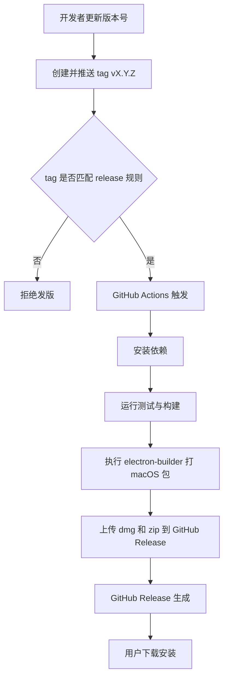
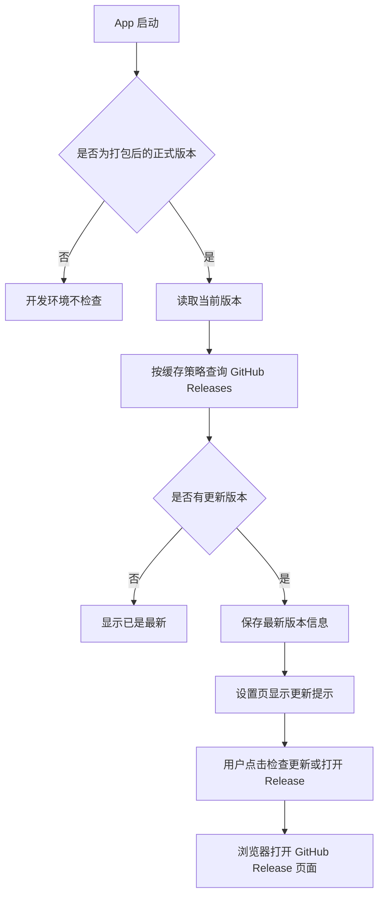

# GitHub Releases 发版与更新设计

**创建日期**: 2026-05-16  
**状态**: 待审查

## 背景

当前 Tomato App 已经具备 `electron-builder` 打包基础，但还没有 GitHub Actions 发版流水线，也没有应用内的更新模块。用户希望把发布流程收敛到 GitHub Releases，并且让 App 能在启动后自动感知 GitHub 上的新版本。

本次设计只覆盖以下三件事：

- GitHub Actions 自动打 macOS 包并发布到 GitHub Releases
- App 自动检查 GitHub Releases 的新版本
- 版本号、tag、release 触发步骤的统一约定

## 目标

- 以 `tag -> GitHub Release` 作为唯一正式发版入口
- 通过 GitHub Actions 在 `macos-latest` 上自动构建 macOS 安装包
- 将构建产物上传到对应的 GitHub Release
- App 启动后自动检查最新 GitHub Release，判断当前版本是否落后
- 在设置页提供手动检查更新入口和版本信息展示
- 版本号、tag、release note 的规则保持一致，避免人工操作分叉
- 保留未来补 Windows 产物和更完整更新能力的扩展空间

## 非目标

- 不在本阶段实现 Windows 打包、Windows 测试或 Windows 发布
- 不在本阶段实现代码签名和 notarization
- 不承诺在无签名条件下实现静默安装式自动更新
- 不引入独立的更新服务器
- 不设计多渠道发布体系，例如 beta / canary / nightly

## 关键约束

- 当前只有 macOS 开发环境，不能依赖本地 Windows 机器验证
- `tomato_app/package.json` 中的 `version` 是应用版本真源
- Release tag 使用 `v${version}` 格式，例如 `v0.1.1`
- 首版只做 macOS release 产物，Windows 路径只预留结构，不在本期执行
- 在没有签名证书时，App 更新能力只做“自动检查 + 提示 + 跳转下载”，不做无感替换安装

## 设计概览

### 1. GitHub Actions 发版流水线

GitHub Actions 负责把“构建”和“发布”串成一个可重复的发布动作。

#### 流程图

#### 触发规则

- 仅当推送 `v*` 格式的 tag 时触发正式发版
- 不使用手动点 workflow 作为主发版入口
- 若 tag 与 `package.json` 版本不一致，workflow 应失败并阻止发布

#### 构建产物

- `dmg`
- `zip`

先保留 electron-builder 默认的产物命名方式，避免在第一版引入额外重命名逻辑。

#### workflow 职责

- 拉取代码
- 安装依赖
- 执行构建与测试
- 调用 `electron-builder` 生成 macOS 包
- 上传 release 资产
- 创建或更新 GitHub Release
- 使用 GitHub 自动生成 release notes，避免手工维护发布说明

### 2. App 更新模块

更新模块的第一版定位是“自动检查 GitHub Releases 的新版本，并把可更新状态清楚展示给用户”。

因为当前没有签名证书，本阶段不把“静默下载并自动替换安装”作为交付目标。等后续补齐签名后，同一套状态和 UI 可以升级到更完整的自动更新方案。

#### 流程图

#### 更新检查时机

- App 启动后自动检查一次
- 设置页提供“检查更新”按钮，用户可手动触发
- 开发环境不做外部 release 检查，避免影响本地调试
- 自动检查采用本地缓存节流策略，默认 24 小时内不重复请求，手动检查不受此限制

#### 更新状态

更新模块至少需要保存以下状态：

- 当前版本
- 最新版本
- 是否有更新
- 最近检查时间
- Release 链接
- 最近错误信息

#### UI 入口

更新入口放在设置页中，和现有同步、数据管理、外观等模块并列。

建议新增一个“版本与更新”卡片，展示：

- 当前版本号
- 最新版本号
- 检查结果
- `检查更新` 按钮
- `打开 Release` 按钮

如果检测到新版本，卡片需要直接显示更新提示，不只写控制台日志。

### 3. 版本号与发版步骤

版本号是整个发布流程的中心。`package.json` 版本、git tag、GitHub Release 三者必须一致。

#### 版本规则

- 版本号采用 SemVer
- tag 采用 `v${version}` 前缀
- `tomato_app/package.json` 是唯一需要人工确认的版本源
- Release note 直接跟随 tag 对应的变更集生成

#### 推荐发版步骤

1. 修改 `tomato_app/package.json` 的 `version`
2. 本地完成测试和构建确认
3. 将版本改动合并到 `main`
4. 创建 tag，例如 `v0.1.1`
5. 推送 tag 到 GitHub
6. GitHub Actions 自动打 macOS 包
7. Workflow 自动创建 GitHub Release 并上传资产
8. App 启动后读取最新 Release 并提示用户更新

#### 失败约束

如果出现以下情况，应该阻止发版并提示修正：

- tag 格式不是 `vX.Y.Z`
- tag 版本和 `package.json` 版本不一致
- 构建失败
- release 资产上传失败

## 代码边界

### 新增或调整的文件

- `.github/workflows/release.yml`
- `tomato_app/electron-builder.yml`
- `tomato_app/src/main/*` 中的更新服务和 IPC 接口
- `tomato_app/src/shared/ipc-channels.ts`
- `tomato_app/src/renderer/components/Settings/SettingsPage.tsx`
- `tomato_app/src/renderer/stores/*` 中的更新状态存储
- `tomato_app/tests/*` 中的单元测试、组件测试和 E2E 测试

### 推荐的职责拆分

- GitHub Actions 只负责构建和发布，不写业务逻辑
- 主进程只负责查询更新状态、比较版本、发出更新事件
- Renderer 只负责展示更新信息和用户操作
- 更新逻辑和 UI 状态分离，避免把 GitHub API 细节写进组件

## 测试策略

更新功能属于用户可见 UI 变化，因此需要补测试。

### 单元测试

- 版本比较逻辑
- GitHub Release 解析逻辑
- 更新状态机

### 组件测试

- 设置页中的“版本与更新”卡片渲染
- 有更新、无更新、检查失败三种状态

### E2E 测试

- 设置页能显示当前版本
- 在测试注入更新可用状态时，页面会显示更新提示和操作按钮
- 点击更新相关按钮能触发正确的外部动作或 IPC

### 发布前验证

- `npm run build`
- `npm run test`
- `npm run test:e2e`
- GitHub Actions 的 release workflow 至少在 macOS job 上跑通一次

## 未来扩展

这一版先保留 Windows 路径，但不强求本地验证。

后续如果补齐签名证书和 Windows 构建环境，可以在不推翻 UI 和版本协议的前提下，把发布矩阵扩展为：

- macOS
- Windows

届时同一套版本号、tag、release 流程可以继续沿用。
