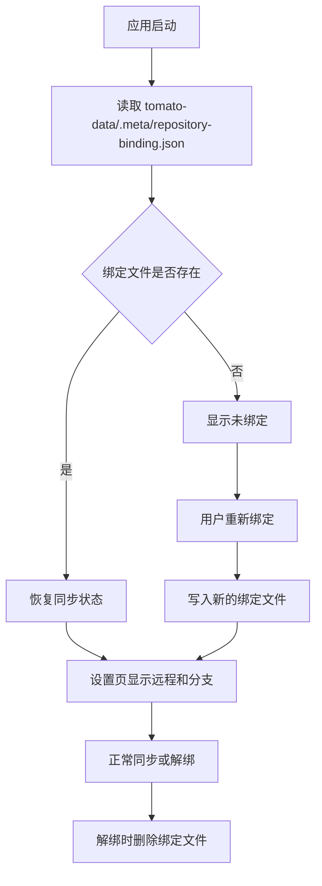

# 同步绑定持久化设计文档

## 概述

当前同步绑定信息和 Git 凭证分散存放在 `app.getPath('userData')` 下的不同文件里：

- `repository-binding.json`
- `github-token.enc`

这导致绑定状态虽然能在同一次安装周期内保留，但如果用户重新安装、迁移或清理应用数据路径，绑定信息就会丢失。

本次设计把同步绑定信息迁移到 `tomato-data/.meta/`，让它跟随本地数据一起走。这样同步配置会和任务、分组、设置一样，统一归属于本地数据目录。

## 目标

- 同步绑定信息保存在 `tomato-data/.meta/` 下
- 绑定信息和本地任务数据使用同一份用户数据目录
- 重新安装应用本体后，只要用户数据目录还在，绑定信息就还在
- 解绑时可以清理对应的绑定文件
- 设置页和同步状态页继续能正常显示绑定状态、分支和错误信息

## 非目标

- 不做机器级永久保存
- 不把绑定信息写进 Git 仓库内容
- 不改变 Git 同步策略本身
- 不改变远端地址、分支或冲突处理逻辑
- 不新增账号体系或登录体系

## 当前问题

现在同步绑定相关状态分散在不同路径里：

- `repository-binding.json` 保存远程地址和分支
- `github-token.enc` 保存凭证

这会让绑定状态对“应用数据目录是否被保留”非常敏感，而且和 `tomato-data` 的生命周期不完全一致。既然本项目的数据本来就统一落在 `app.getPath('userData')/tomato-data`，同步绑定也应当并入这一层。

## 设计决策

### 1. 绑定元数据迁入 `tomato-data/.meta/`

同步绑定元数据不再单独放在 `app.getPath('userData')` 根目录，而是写入：

`tomato-data/.meta/repository-binding.json`

这样绑定状态就和其他 app 级元数据一样，属于 `tomato-data` 这个本地数据目录的一部分。

### 2. 凭证状态与绑定状态分开处理

本设计只要求“绑定信息”进入 `tomato-data/.meta/`。Git 凭证如果仍需要保留，可以继续作为独立凭证文件或系统凭证处理，但其生命周期也应当和本地数据目录对应起来。

如果后续需要把 token 也放进 `tomato-data/.meta/`，那应当单独评估安全性和加密方式，不和本次绑定元数据迁移混在一起。

### 3. 解绑要清理迁移后的绑定文件

解绑时删除 `tomato-data/.meta/repository-binding.json`，同时清理运行时同步状态，让 UI 回到未绑定态。

解绑不应删除任务数据、分组数据或笔记数据。

### 4. 启动时优先从新路径恢复

同步服务启动或首次查询状态时，先从新位置读取绑定元数据。如果新路径存在，就以新路径为准。

这条规则确保迁移完成后，renderer 的同步卡片能在启动时自动恢复状态，而不需要用户重新填一次远程和分支。

## 用户流程

## 数据与状态

### 绑定元数据

绑定元数据仍然保留现有字段，不改变语义：

- `remoteUrl`
- `remoteLabel`
- `remoteBranch`
- `boundAt`
- `updatedAt`

如果后续同步状态还要保存额外字段，也应继续放在 `tomato-data/.meta/` 中，而不是散落在应用根路径。

### 目录约定

- `tomato-data/tasks/` 保存任务
- `tomato-data/groups/` 保存分组
- `tomato-data/notes/` 保存笔记
- `tomato-data/stats/` 保存统计
- `tomato-data/.meta/` 保存应用级元数据，包括设置和同步绑定

## 需要修改的模块

- `tomato_app/src/main/sync/repository-binding.ts`
- `tomato_app/src/main/sync/sync-service.ts`
- `tomato_app/src/main/database.ts`
- `tomato_app/src/renderer/components/Sync/SyncSettings.tsx`
- `tomato_app/src/renderer/components/Sync/SyncStatus.tsx`
- `tomato_app/src/renderer/stores/sync-store.ts`
- `tomato_app/tests/main/sync/repository-binding.test.ts`
- `tomato_app/tests/main/sync/sync-service.test.ts`
- `tomato_app/tests/stores/sync-store.test.ts`

## 验收标准

- 绑定后的远程地址和分支会写入 `tomato-data/.meta/`
- 重启应用后，绑定状态仍然可以自动恢复
- 重新安装 App 本体后，只要 `tomato-data` 目录还在，绑定状态就还在
- 解绑后绑定文件会被清理
- UI 仍然可以正确显示绑定状态、分支和错误信息

## 测试计划

### 单元测试

- `RepositoryBindingStore` 能读写 `tomato-data/.meta/repository-binding.json`
- `SyncService` 仍然可以从新路径恢复绑定状态
- 解绑会清理新的绑定文件

### Renderer store

- `sync-store` 仍然能通过 `getStatus()` 恢复绑定信息
- `unbindRepository()` 后状态回到未绑定

### E2E

- 绑定仓库后刷新或重启，设置页仍显示远程和分支
- 解绑后再次进入设置页，绑定状态恢复为未绑定

## 说明

这份设计只处理“绑定信息放哪里”的问题，不改同步算法本身。重装应用本体后是否保留，取决于用户是否保留了 `tomato-data` 目录；这个边界是本次设计的核心前提。
