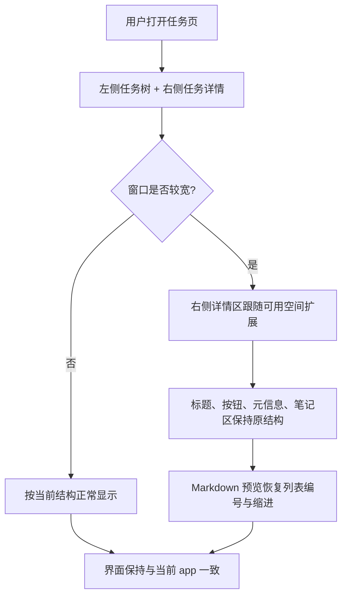

# 任务详情阅读区优化设计文档

## 概述

当前任务页在窗口变宽后，右侧任务详情区仍然被 `max-w-2xl` 限制住，导致可用空间没有被充分利用。与此同时，任务笔记的 Markdown 预览里，有序列表的编号样式在预览中不够稳定，用户会感觉 `1. 2. 3.` 这类前缀“消失了”。

这份设计只优化任务详情页的阅读与编辑体验，保持现有页面结构不变：左侧仍然是任务树，右侧仍然是任务详情和笔记编辑区，不引入新的分栏模式，也不把界面改成另一种产品形态。

## 目标

- 任务页在宽屏下，右侧任务详情区可以真正吃满可用空间
- 任务详情页继续沿用当前的现有结构，不新增新的布局层级
- 笔记 Markdown 预览中的有序列表编号要稳定可见
- 列表缩进、项目符号和正文排版保持可读
- 视觉上仍然像当前 app，而不是一个重新设计过的界面

## 非目标

- 不把笔记区改成左右双栏编辑/预览布局
- 不改任务树的交互
- 不改笔记保存逻辑
- 不改同步逻辑
- 不改任务完成、开始专注等按钮功能
- 不引入全局 Markdown 样式重置

## 当前问题

### 1. 详情区宽度被固定上限限制

`TaskDetail` 当前外层容器使用了 `max-w-2xl`。当任务页窗口较宽时，右侧详情区仍然只保留较窄的阅读宽度，结果是：

- 中间内容看起来很挤
- 右侧有大量空白没有被利用
- 用户会觉得“最大化后没有真的放大”

### 2. Markdown 预览的有序列表样式不稳定

任务笔记使用 Markdown 预览时，有序列表的编号前缀在当前样式下不够稳定。这个问题更像是局部预览容器没有明确恢复 `ol` / `ul` 的默认表现，而不是 Markdown 内容本身有问题。

## 设计决策

### 1. 右侧详情区改为随可用空间伸展

任务详情页继续保留现有的标题区、操作按钮区、状态提示区和笔记编辑区，但外层容器不再用固定的最大宽度把它卡住。

设计原则：

- 详情区外层允许横向占满右侧可用空间
- 内容本体保留 `min-w-0`，避免 flex 布局下溢出
- 不改变当前任务页的左右分区结构
- 不新增第二套“宽屏模式”

这意味着宽屏下的变化应当是“同一套界面更舒展”，而不是“界面切换成另一套样子”。

### 2. Markdown 预览只做局部样式修复

有序列表的编号恢复应该只作用在任务笔记预览容器内部，不扩散到整个应用。

局部样式需要明确保证：

- `ol` 能显示数字编号
- `ul` 能显示圆点或等价项目符号
- 列表项具有合适的左侧缩进
- 列表和段落之间保留基本垂直间距

这个修复只针对任务笔记的预览区，不影响设置页、统计页或其它 Markdown 内容。

### 3. 编辑器和阅读区保持当前结构

本次不把笔记区改成左右分栏，也不把预览和编辑器拆成独立大面板。现有结构继续保留：

- 顶部是任务标题和操作按钮
- 中间是任务元信息
- 底部是笔记编辑/预览区域

这样可以避免把当前 app 的交互心智打乱。

### 4. 宽屏下的阅读舒适度优先于绝对铺满

右侧详情区可以铺满可用宽度，但 Markdown 正文不一定要无限变宽。若需要，可让外层容器吃满宽度，同时通过局部阅读宽度控制保持正文可读性。

这条的目的不是“让内容越宽越好”，而是“让布局不要浪费空间，同时不要牺牲阅读体验”。

## 用户流程

## 数据与状态

### 布局状态

布局状态仍然由当前窗口宽度和任务页现有 flex 布局决定，不新增独立的布局状态。

### Markdown 预览状态

Markdown 预览仍然依赖现有笔记内容，不改变笔记持久化格式，也不改变 Markdown 数据源。

## 需要修改的模块

- `tomato_app/src/renderer/components/TaskList/TaskDetail.tsx`
- 必要时新增任务笔记预览局部样式封装
- `tomato_app/tests/e2e/basic-acceptance-task-notes.spec.ts`
- 必要时补充一个布局回归用 E2E 场景

## 验收标准

- 在较宽窗口下，任务详情区不再被固定宽度卡住
- 左侧任务树、分割线和右侧详情区仍然保持当前 app 的结构
- 笔记预览中的有序列表编号可以稳定显示
- 笔记预览中的列表缩进和段落间距可读
- 没有引入新的双栏阅读模式
- 没有把全局 Markdown 样式一起改坏

## 测试计划

### E2E

- 打开任务页，确认右侧详情区在宽屏下会占用更多可用空间
- 在笔记中输入有序列表，确认预览里能看到编号前缀
- 刷新页面后，布局和预览结果保持一致

### 视觉回归

- 用一张基于当前真实 UI 的对照图确认放大后没有打破现有设计语言
- 对照重点只看：右侧宽度、标题区、按钮排布、笔记区列表编号

## 自动化验证策略

为了避免以后再返工，这个问题不能只靠肉眼看“宽不宽”，而要把两件事都锁住：

- 布局回归：任务详情区在宽屏下确实能伸展
- 预览回归：有序列表编号确实能显示

如果后续又调整任务详情页的 flex 结构，必须重新跑相关 E2E，不允许只改样式但不验证结果。

