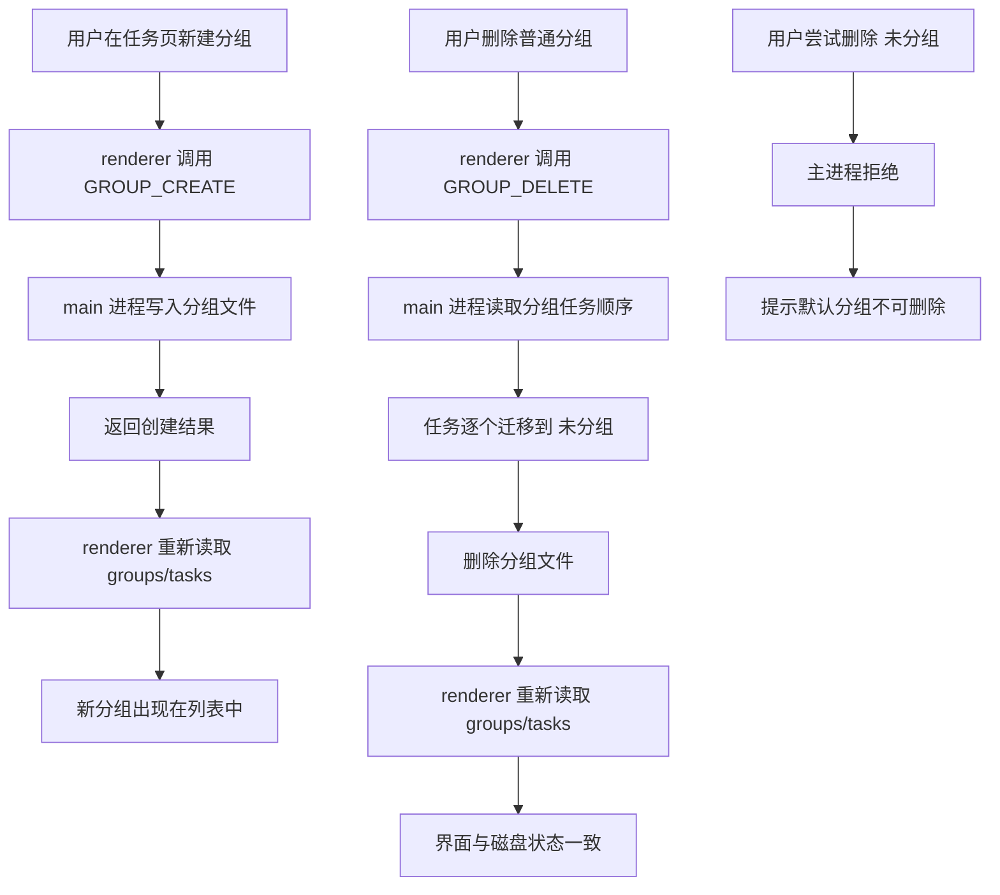

# 任务组持久化与删除迁移设计文档

## 概述

当前任务组相关行为存在两个明显问题：

- 新建任务组只更新了 renderer 本地状态，没有稳定落盘，所以重启后会消失
- 删除普通任务组时，组内任务的处理规则不够明确，需要改成迁移到 `未分组`

这版设计只处理任务组的创建、删除与重载恢复，不引入新的分组层级，也不改动任务内容本身。

## 目标

- 新建任务组后，刷新页面或重启应用后仍然存在
- 删除普通任务组时，组内任务自动迁移到默认分组 `未分组`
- 重命名任务组后，刷新页面或重启应用后仍然保持新名称
- 默认分组 `未分组` 继续保持不可删除
- 创建、删除、重命名之后，renderer 必须重新从主进程读取数据，保证 UI 与磁盘状态一致

## 非目标

- 不重做任务列表 UI
- 不改变任务的编辑、拖拽、完成逻辑
- 不引入新的分组类型或嵌套分组

## 现状问题

### 1. 新建分组只改了前端 store

任务组列表当前在 renderer 中直接调用本地状态更新，新分组只进入内存，不一定经过主进程的持久化路径。这样一来，页面刷新或应用重启后，分组就会丢失。

### 2. 删除分组时，任务没有迁移规则

核心任务管理器已经能删除任务组，但现有行为更接近“删除组时顺带删除任务”。这与用户预期不一致，也不适合默认分组之外的普通分组。

## 设计决策

### 1. 创建任务组必须走主进程持久化

renderer 不再把“创建分组”当成纯本地操作，而是通过 IPC 让主进程创建分组文件，再由 renderer 重新拉取 groups/tasks 数据。

创建流程：

1. 用户输入分组名称
2. renderer 调用 `IPC.GROUP_CREATE`
3. main 进程通过 `TaskManager.createGroup()` 创建分组
4. 主进程写入磁盘后返回创建结果
5. renderer 重新 hydrate 分组列表

这样可以保证“创建成功”与“磁盘落盘成功”是一致的。

### 1.5. 重命名任务组也必须走主进程持久化

任务组重命名不再只改 renderer 本地状态，而是和创建、删除一样走 IPC：

1. 用户编辑任务组名称
2. renderer 调用 `IPC.GROUP_RENAME`
3. main 进程通过 `TaskManager.renameGroup()` 更新分组文件
4. renderer 重新 hydrate 分组列表

这样能避免刷新后任务组名称回退成旧值。

### 2. 删除普通分组时，把任务迁移到 `未分组`

删除分组时，主进程负责完成迁移与删除，不让 renderer 自己拼状态。

删除规则：

- 如果目标分组是 `DEFAULT_GROUP_ID`，直接拒绝
- 读取待删除分组的 `taskOrder`
- 按 `taskOrder` 的顺序，把任务逐个迁移到默认分组
- 迁移后，任务的 `groupId` 统一改为 `DEFAULT_GROUP_ID`
- 迁移后的任务追加到默认分组的 `taskOrder` 末尾
- 最后删除分组文件

这里的关键是“保序”。被删分组里的任务进入 `未分组` 后，顺序应该与原分组中的顺序一致，避免删除分组后任务位置随机变化。

### 3. 创建、删除、重命名后都要重新 hydrate

renderer 不只依赖乐观更新，而是在 mutation 成功后主动重新读取：

- `task:getAll`
- `group:getAll`

这样可以避免本地 store 与磁盘状态短暂不一致，尤其是在重启恢复场景里。

### 4. 默认分组保持特权

默认分组 `未分组` 仍然是特殊分组：

- 可以接收迁移过来的任务
- 不能被删除
- 不需要额外的迁移目标选择

这个规则保持不变，只是删除普通分组时会更明确地使用它。

## 用户流程

## 数据与状态

### 分组创建

分组仍然使用现有的文件化存储结构，创建时生成新的分组文件。分组记录至少包含：

- `id`
- `name`
- `taskOrder`
- `createdAt`
- `updatedAt`

### 分组删除

删除动作只删除分组本身，不删除任务记录，也不删除任务笔记。

任务迁移后：

- `task.groupId` 指向 `DEFAULT_GROUP_ID`
- 默认分组的 `taskOrder` 追加这些任务 ID
- 任务原来的分组文件被移除

## 需要修改的模块

- `packages/core/src/tasks/task-manager.ts`
- `tomato_app/src/main/ipc-handlers.ts`
- `tomato_app/src/renderer/components/TaskList/TaskGroupList.tsx`
- `tomato_app/src/renderer/components/TaskList/TaskGroupHeader.tsx`
- `tomato_app/src/renderer/stores/task-store.ts`

## 验收标准

- 新建一个普通分组后，刷新页面仍然可见
- 关闭应用再打开后，分组仍然存在
- 删除一个普通分组后，组内任务仍然存在，并出现在 `未分组`
- 删除普通分组后，任务顺序保持与原分组一致
- 重命名普通分组后，刷新页面仍然保持新名称
- 尝试删除 `未分组` 时会被拒绝
- 创建或删除分组后，UI 不会只依赖本地 store 的残留状态

## 测试计划

### Core 单测

- 新建分组会写入持久层
- 删除分组会把任务迁移到默认分组
- 重命名分组会写入持久层
- 默认分组删除会抛出错误

### Renderer 单测

- 创建分组后会触发重新 hydrate
- 删除分组后会刷新 groups/tasks 状态

### E2E

- 新建分组后刷新页面，分组仍存在
- 删除普通分组后，任务进入 `未分组`
- 重命名普通分组后刷新页面，名称仍存在
- 默认分组删除入口不可用或会明确报错

## 说明

这份设计只覆盖任务组这一条，不会同时改动设置输入、笔记闪烁、同步持久化或 Markdown 预览。那些会按独立 workstream 继续拆分，避免这次修复范围失控。
