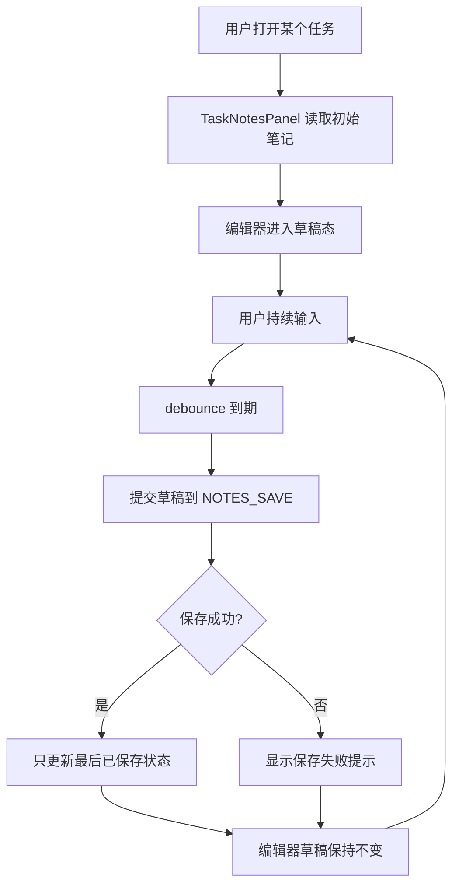

# 任务笔记闪烁修复设计文档

## 概述

当前任务笔记在同一个任务里持续输入时，会在自动保存触发前后出现短暂的清空或重载感。这个问题不是笔记持久化本身失效，而是编辑区的受控状态、自动保存状态和页面重渲染耦合得太紧。

本次设计只处理任务详情里的笔记编辑体验，不改任务数据结构，不改笔记文件格式，也不改同步逻辑。

## 目标

- 同一个任务内持续输入时，笔记正文不应短暂清空或重载
- 自动保存仍然保留
- Markdown 预览仍然保留
- 保存中的提示和错误提示仍然保留，但不会引发编辑器闪烁
- 自动化测试可以稳定验证“输入过程中内容不丢失”

## 非目标

- 不改任务笔记的文件格式
- 不改 `NOTES_GET` / `NOTES_SAVE` 的 IPC 语义
- 不取消自动保存
- 不把笔记编辑改成富文本编辑器
- 不改任务详情页其他功能按钮

## 当前问题

`TaskDetail` 里把笔记正文、保存状态、加载状态和错误状态都放在同一个组件里。当前流程是：

1. 任务被选中后，先清空本地 `notes`
2. 异步读取持久化笔记
3. 输入过程中，`useDebounce` 触发自动保存
4. 保存状态变化会导致整个 `TaskDetail` 重新渲染
5. `MDEditor` 在这个过程中出现内容短暂重绘，用户看到“闪一下”或“空一下”的感觉

问题的核心不是“保存失败”，而是“保存状态变化会影响编辑器自身的稳定性”。

## 设计决策

### 1. 把笔记编辑区拆成独立子组件

`TaskDetail` 继续负责任务标题、按钮和任务选择逻辑，笔记编辑区拆成独立组件，例如 `TaskNotesPanel`。

拆分后：

- `TaskDetail` 只把当前任务 id 和初始笔记传给子组件
- `TaskNotesPanel` 自己管理草稿、加载态、保存态、错误态
- 保存状态变化不会把整个任务详情页一起拖着重渲染

这一步的目的，是让编辑器成为一个边界清晰的局部状态单元。

### 2. 编辑器只认“草稿值”，不要在保存过程中回填正文

笔记正文编辑区使用本地草稿作为唯一输入源：

- 任务切换时，草稿从持久化内容初始化
- 输入时只更新草稿
- 自动保存触发时只提交草稿，不重置草稿
- 保存成功后，只更新“最后已保存内容”和提示状态，不回写成空值或中间态

这条是防闪的关键。保存动作应该影响“持久化结果”，而不应该反向污染当前输入内容。

### 3. 保存状态和编辑器主体分离

保存中提示、错误提示、最后保存结果这些状态放在编辑器外层或旁边，而且要尽量保持固定高度，避免提示条出现/消失时把编辑区顶来顶去。

设计要求：

- 保存中提示保留
- 保存失败提示保留
- 提示区预留固定高度或最小高度
- 编辑器本体不要因为提示出现/消失而改变尺寸

### 4. 自动保存继续保留，但只在内容变化时触发

现有的 debounce 自动保存逻辑继续保留，但要确保：

- 只有草稿真的变化时才触发保存
- 保存状态变化不再反过来触发新的保存
- 同一轮保存成功后，不再用回填动作把输入框重置一次

现有 `shouldAutoSaveNotes` 仍然可以作为基础判断，但需要配合更清晰的草稿生命周期。

### 5. 任务切换时才重新初始化草稿

只有当 `task.id` 真正变化时，笔记编辑区才重新加载并重置草稿。

同一个任务内发生的：

- 自动保存成功
- 保存失败
- 保存提示显示/隐藏
- 其他页面状态重渲染

都不应该把草稿清空或重新载入。

## 用户流程

## 数据与状态

### 草稿状态

草稿状态只存在于 renderer 中，用来支撑输入中的稳定体验。

草稿状态至少需要区分：

- 当前 task id
- 当前草稿正文
- 是否已完成加载
- 是否正在保存
- 最近一次已保存正文
- 最近一次错误信息

### 持久化状态

持久化状态仍然是原来的 notes 文件：

- `NOTES_GET` 负责读取当前 task 的笔记
- `NOTES_SAVE` 负责保存当前 task 的笔记

这次修复不改变存储路径，也不改变 IPC 协议。

## 需要修改的模块

- `tomato_app/src/renderer/components/TaskList/TaskDetail.tsx`
- `tomato_app/src/renderer/lib/task-notes.ts`
- `tomato_app/tests/e2e/basic-acceptance-task-notes.spec.ts`
- `tomato_app/tests/lib/task-notes.test.ts`

## 验收标准

- 同一个任务里持续输入笔记时，正文不会短暂清空或重载
- 自动保存仍然会写入 notes 文件
- 页面刷新后，已保存内容仍然可读回
- 保存中的提示仍然可见，但不会让编辑区闪烁
- 保存失败时会显示错误，但不会把正文内容清掉

## 测试计划

### 单元测试

- `shouldAutoSaveNotes` 只在草稿与已保存内容不同且已加载完成时返回 `true`
- 草稿生命周期辅助函数不会在保存状态变化时清空正文

### 轻量交互测试

- 如果后续实现引入可独立渲染的 `TaskNotesPanel`，可以补一条轻量交互测试验证保存状态切换时草稿不变
- 这不是本次必须新增的测试层级，核心回归仍然由单元测试和 E2E 覆盖

### E2E

- 打开任务，输入一段笔记，等待自动保存触发，正文不应清空
- 自动保存完成后继续输入，正文仍保持完整
- 刷新后再次打开，已保存内容仍然存在

## 自动化验证策略

为了避免以后返工，这个问题的回归判断不能只靠人工看闪不闪，而要用自动化验证锁住：

- Playwright E2E 负责验证真实输入过程中的正文不会丢
- Vitest 负责验证草稿状态的纯逻辑不会因为保存状态变化而重置

如果后续在编辑器实现中再引入新的状态字段，必须补回归测试，不能只改视觉表现。
