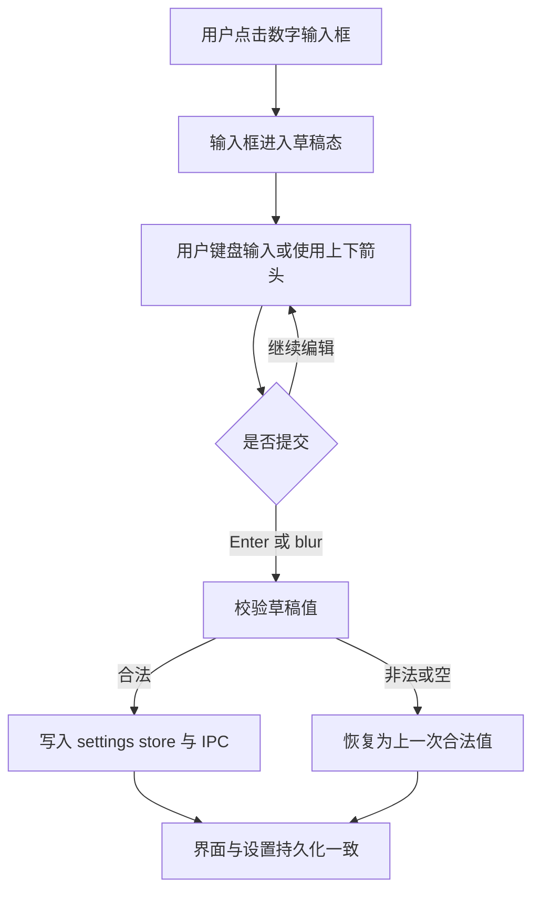

# 计时设置数字输入交互设计文档

## 概述

设置页里的 4 个计时数字项目前都使用 `type="number"`，但输入体验不够顺手：用户在直接键盘输入时，控件会随着每次变更立即回写设置，容易打断选中、替换和连续编辑的过程。

本次设计只调整这 4 个字段的输入交互：

- `番茄时长`
- `短休息`
- `长休息`
- `长休息间隔`

目标是同时保留数字输入框的上下调节能力，并允许用户像普通文本框一样直接键盘输入。

## 目标

- 4 个数字项都保留上下箭头调节能力
- 4 个数字项都可以直接选中数字后键盘替换
- 输入过程中不被立即写回打断
- 用户在 `blur` 或按 `Enter` 后提交修改
- 非法或空输入在提交时回退到上一次合法值

## 非目标

- 不重做设置页布局
- 不改变通知项、外观项、数据同步项的交互
- 不新增设置项
- 不改变最终写入的设置值格式

## 当前问题

当前 4 个计时数字项直接把 `onChange` 与 `SETTINGS_SET` 绑定在一起。这样每敲一个键都会立刻触发 store 更新和 IPC 写入，导致：

- 选中已有数字后直接替换时，光标和选区体验不稳定
- 连续输入时，控件容易表现得像“只能点箭头调值”
- 还没输入完，值就已经被提交到持久层

这个问题不是数值存储本身，而是编辑过程和提交过程绑得太紧。

## 设计决策

### 1. 每个数字项维护本地草稿值

4 个数字项改为“草稿态 + 提交态”两段式编辑。

实现上，每个输入框在 renderer 内维护自己的本地字符串草稿：

- 初始值来自当前设置 store
- 用户在输入框中编辑时，只更新草稿，不立即写回 store
- 草稿在 `blur` 或按 `Enter` 时提交
- 按 `Escape` 可放弃草稿并恢复到当前已保存值

这样可以保留 `type="number"` 的原生调节能力，同时避免每次键盘输入都触发持久化。

### 2. 提交时再写入 settings store 和 IPC

只有在确认输入完成时，才把值同步到设置存储：

1. 读取草稿字符串
2. 校验是否为合法正整数
3. 若合法，调用现有的 `updateKey`
4. 若无效，回退到上一次合法值

这意味着设置存储仍然是单一真相，只是编辑过程不再实时推送。

### 3. 保留原生数字输入外观

输入框继续使用原生数字控件：

- `type="number"`
- `min` / `max` 保留
- 保留浏览器原生的上下调节箭头
- 不替换成自定义步进器

这样用户既能拖动/点箭头，也能直接键盘编辑，不需要学习新的控件。

### 4. 空值和非法值的处理

编辑中允许短暂出现空字符串或不完整输入，但提交时必须回到合法整数。

规则如下：

- 提交时如果为空或无法解析成正整数，则恢复到上一次合法值
- 不把空字符串写入持久层
- 不把非法值写入持久层

这条规则保证输入过程足够宽松，写入结果仍然稳定。

## 用户流程

## 数据与状态

### 草稿状态

每个数字项需要一个本地草稿值，用于输入过程中的临时显示。

草稿值只存在于 renderer，不进入持久化层。

### 已提交状态

已提交状态仍然是现有的 settings store 与主进程配置文件：

- `pomodoroDuration`
- `shortBreakDuration`
- `longBreakDuration`
- `longBreakInterval`

本次设计不改变这些 key 的存储位置或格式。

## 需要修改的模块

- `tomato_app/src/renderer/components/Settings/SettingsPage.tsx`
- `tomato_app/tests/e2e/basic-acceptance-settings.spec.ts`
- 必要时补充 `tomato_app/tests/components/` 下的设置页单测

## 验收标准

- 4 个计时数字项都可以直接点击后键盘输入
- 4 个计时数字项都保留上下箭头调节
- 选中数字后直接输入可以正常替换
- 输入过程中不会每敲一个键就立刻写回持久层
- `blur` 或 `Enter` 后会保存
- 空值或非法输入不会写入设置
- 刷新页面后，已保存值保持不变

## 测试计划

### 组件行为

- 数字输入框在编辑过程中只更新本地草稿
- `blur` / `Enter` 会触发保存
- `Escape` 会放弃草稿并恢复已保存值

### E2E

- 修改 `番茄时长`、`短休息`、`长休息`、`长休息间隔` 后刷新仍保留
- 直接在数字框中输入时，选中替换不会被中途打断
- 上下箭头仍然可用

## 说明

这份设计只解决输入体验，不改变设置页布局，也不改其它设置项。如果后续需要再做数字项统一样式或更强的校验提示，可以单独拆成下一条 workstream。
